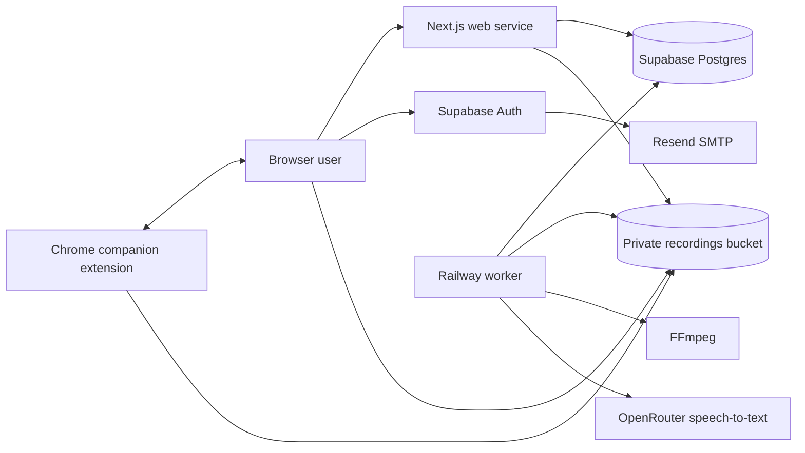

# cauli Technical Reference

## 1. Purpose and Scope

cauli is an invite-only browser call recording, transcription, and quality
review application. The web application is the primary interface. A Chrome
extension remains as a launcher and a migration bridge for recordings created
by the legacy extension.

This document describes the behavior implemented in the repository:

- Repository and runtime architecture
- Website pages and navigation
- Authentication and role permissions
- API endpoints and request contracts
- Browser recording, upload, recovery, and finalization
- Worker processing, FFmpeg conversion, and transcription
- Database tables, SQL functions, RLS, and Storage policies
- Scorecards and review revisions
- Extension migration behavior
- Shared, web, worker, and extension utility functions
- Environment configuration, deployment, health checks, and tests

The production web origin is `https://cauli.pro`. Authentication email is sent
through Supabase Auth and Resend as `cauli <cal@cauli.pro>`.

## 2. System Architecture



### Runtime services

| Service | Technology | Responsibility |
| --- | --- | --- |
| Web | Next.js App Router, React, TypeScript | Pages, session handling, server rendering, API routes, signed media URLs |
| Worker | Node.js, TypeScript, FFmpeg | Job claiming, audio assembly, format generation, transcription, deletion, cleanup |
| Database | Supabase Postgres | Application records, roles, RLS, idempotent jobs, reviews, revisions |
| Object storage | Supabase Storage | Private chunks, source WebM, MP3, WAV exports, imported audio |
| Authentication | Supabase Auth | Invite-only users, magic links, session cookies |
| Email | Resend SMTP through Supabase | Invitation and magic-link delivery |
| Transcription | OpenRouter | Timestamped speech-to-text |
| Companion | Chrome Manifest V3 extension | Opens the web app and migrates legacy recordings |

### Trust boundaries

- The browser uses the Supabase anonymous key and the signed-in user's session.
- The browser may upload only authorized recording chunks through Storage RLS.
- Next.js server components normally query with the user's session so RLS applies.
- API routes use explicit authorization before any service-role operation.
- The worker uses the service-role key and must be treated as a privileged service.
- Media playback and downloads use signed URLs that expire after 600 seconds.
- The extension migration bridge accepts messages only from the compiled web origin.
- Extension audio uploads accept only signed URLs on the compiled Supabase origin.

## 3. Repository Structure

```text
apps/
  web/                 Next.js application, API routes, and browser recorder
  worker/              Background processing and transcription worker
  extension/           Chrome companion and retained legacy recorder
packages/
  shared/              Shared types, schemas, permissions, states, and scoring
supabase/
  migrations/          Postgres schema, functions, RLS, and Storage policies
docs/
  DEPLOYMENT.md         Deployment instructions
  MANUAL_TESTING.md     Manual release checks
  TECHNICAL_REFERENCE.md
railway.web.toml        Railway web build and health configuration
railway.worker.toml     Railway worker build and health configuration
package.json            npm workspace orchestration
```

The npm package scope remains `@calllog/*` for internal compatibility. Product
branding is `cauli`.

## 4. Website Routing and Pages

### Public and routing pages

| Route | Access | Component | Behavior |
| --- | --- | --- | --- |
| `/` | Public | `HomePage` | Redirects to `/setup`, `/login`, or `/record` based on configuration and session |
| `/setup` | Public | `SetupPage` | Reports whether public Supabase and service-role configuration is present |
| `/login` | Signed-out | `LoginPage`, `LoginForm` | Sends an invite-only Supabase magic link; user creation is disabled |
| `/auth/callback` | Public callback | Route handler | Exchanges the PKCE code for a session and redirects to `/record` |

### Authenticated application pages

The `(app)` route group uses `AuthenticatedLayout`. It calls
`requirePageAuth()`, forces dynamic rendering, and wraps every page in
`AppShell`.

| Route | Roles | Page behavior |
| --- | --- | --- |
| `/record` | Member, manager, admin | Records Mic, Tab, or Both; shows interrupted drafts and recovery actions |
| `/calls` | Member, manager, admin | Lists the current user's calls and exposes extension import when available |
| `/team` | Manager, admin | Lists all visible workspace calls; members redirect to `/calls` |
| `/calls/[id]` | Authorized viewer | Playback, metadata, transcript seeking, downloads, exports, processing errors, reviews, deletion |
| `/admin/team` | Admin | Sends invitations, changes roles, removes members, lists pending invites |
| `/admin/scorecards` | Admin | Edits and publishes immutable scorecard versions |

### Navigation

`AppShell` builds navigation from the signed-in role:

- Every role: Record, My Calls
- Manager and admin: Team Calls
- Admin: Team Admin, Scorecards

The account block displays the email, role, and a sign-out action.

## 5. Primary UI Components

| Component | Responsibility |
| --- | --- |
| `AppShell` | Role-aware navigation and account controls |
| `LoginForm` | Magic-link sign-in using `signInWithOtp` and `shouldCreateUser: false` |
| `RecorderPanel` | Media acquisition, mixing, chunk persistence, upload, stop/finalize, and recovery |
| `CallTable` | Responsive call list with processing and review statuses |
| `CallDetailClient` | Signed playback, timestamp seeking, downloads, WAV requests, retries, and deletion |
| `ReviewEditor` | Criterion answers, comments, summary, score preview, status, optimistic submission, revision display |
| `TeamAdmin` | Invitations, role updates, member removal, and pending invites |
| `ScorecardAdmin` | Category and criterion editor; publishes a new immutable version |
| `ExtensionImport` | Detects the companion extension and coordinates resumable migration |
| `StatusPill` | Consistent call and review status presentation |
| `PageHeader` | Page title and descriptive copy |
| `NavItem` | Active route navigation item |

## 6. Authentication and Authorization

### Authentication flow

1. An admin creates an invitation from Team Admin.
2. The server upserts `workspace_invites`.
3. Supabase Admin sends an invitation email through Resend.
4. The user opens the callback link.
5. `/auth/callback` exchanges the code for a session cookie.
6. The `on_auth_user_created` trigger creates a profile and applies a matching
   unexpired workspace invitation.
7. `proxy.ts` refreshes Supabase session cookies on application requests.

Normal login uses the same callback flow but calls `signInWithOtp` with
`shouldCreateUser: false`, preventing uninvited account creation.

### Role matrix

| Capability | Member | Manager | Admin |
| --- | --- | --- | --- |
| Record calls | Yes | Yes | Yes |
| View own calls | Yes | Yes | Yes |
| View all workspace calls | No | Yes | Yes |
| Download visible calls | Own only | All visible | All |
| Read reviews on visible calls | Yes | Yes | Yes |
| Create or revise reviews | No | Yes | Yes |
| Delete own calls | Yes | Yes | Yes |
| Delete another user's call | No | No | Yes |
| Retry failed visible calls | Own only | Yes | Yes |
| Request WAV for visible calls | Own only | Yes | Yes |
| Invite users and manage roles | No | No | Yes |
| Publish scorecards | No | No | Yes |

### Enforcement layers

- Shared permission functions provide consistent application decisions.
- API handlers call `requireApiAuth()` and `authorizeCall()`.
- Server-rendered reads use the signed-in Supabase client and RLS.
- Postgres RLS independently restricts workspaces, calls, transcripts, reviews,
  scorecards, imports, and audit records.
- Privileged SQL functions verify authorization or are executable only by the
  service role.

## 7. API Reference

All application endpoints return JSON unless noted. Validation failures return
`400`; missing sessions return `401`; role failures return `403`; inaccessible
resources are generally returned as `404`.

### Calls

#### `POST /api/calls`

Creates a call in `recording` state.

Request:

```json
{
  "sourceMode": "both",
  "micLabel": "MacBook Microphone",
  "tabLabel": "Sales dialer"
}
```

Response `201`:

```json
{
  "callId": "uuid",
  "workspaceId": "uuid",
  "status": "recording",
  "startedAt": "ISO timestamp",
  "storagePrefix": "workspace-id/call-id/chunks"
}
```

#### `POST /api/calls/:id/finalize`

Owner-only. Records the expected final sequence and queues an idempotent
`process_recording` job through `finalize_call`.

```json
{
  "finalChunkSequence": 12,
  "durationMs": 125000,
  "mimeType": "audio/webm;codecs=opus",
  "sourceMode": "both",
  "micLabel": "MacBook Microphone",
  "tabLabel": "Sales dialer"
}
```

Repeating the same completed finalization is safe. The job key is
`process:<call-id>`.

#### `POST /api/calls/:id/retry`

Visible failed calls only. Sets the call back to `queued` and resets/upserts the
processing job without creating another logical job.

#### `POST /api/calls/:id/exports`

Requests an asynchronous WAV export for a visible call. Returns `complete` if
the WAV already exists; otherwise returns `202` and an export job ID. The
processing idempotency key is `wav:<call-id>`.

#### `GET /api/calls/:id/media`

Query parameters:

- `format=mp3` - default playback artifact
- `format=source` - retained WebM source
- `format=wav` - generated WAV export
- `download=1` - sets download disposition

Returns a private signed URL valid for 600 seconds.

#### `POST /api/calls/:id/review?scorecardVersionId=<uuid>`

Manager or admin only.

```json
{
  "expectedVersion": 2,
  "status": "reviewed",
  "summary": "Strong discovery and clear next steps.",
  "answers": [
    {
      "criterionId": "uuid",
      "value": 4,
      "comment": "Good question sequence."
    },
    {
      "criterionId": "uuid",
      "value": null,
      "comment": "Not applicable."
    }
  ]
}
```

Returns `409` when another session has already changed the canonical review.

#### `DELETE /api/calls/:id`

Allowed for the owner or an admin. Immediately soft-deletes the call and queues
physical storage and row deletion with key `delete:<call-id>`. Returns `204`.

### Administration

#### `POST /api/admin/invites`

Admin only.

```json
{
  "email": "person@example.com",
  "role": "member"
}
```

Upserts a seven-day invite, sends Supabase Auth email, upserts membership when
Supabase returns an invited user, and writes an audit event.

#### `PATCH /api/admin/members/:id`

Admin only. Body is `{ "role": "manager" }`. The final workspace admin cannot
demote themself.

#### `DELETE /api/admin/members/:id`

Admin only. Removes workspace membership. The final admin cannot remove
themself.

#### `POST /api/admin/scorecards`

Admin only. Creates a template or publishes the next immutable version.

```json
{
  "templateId": "uuid-or-null",
  "name": "Call Quality",
  "categories": [
    {
      "name": "Discovery",
      "criteria": [
        {
          "label": "Asked open questions",
          "description": "Evaluates discovery depth.",
          "weight": 2,
          "required": true
        }
      ]
    }
  ]
}
```

### Extension import

#### `POST /api/extension-imports/prepare`

Accepts a random nonce and legacy recording metadata. It deduplicates each
recording by `(workspace_id, user_id, legacy_recording_id)`, creates resumable
import/call records, and returns signed upload targets.

#### `POST /api/extension-imports/complete`

Verifies the nonce hash and upload results. It preserves completed legacy
transcripts, chooses usable source audio, queues processing, and marks
audio-less records as failed.

### Session and health

| Endpoint | Behavior |
| --- | --- |
| `POST /api/auth/signout` | Clears Supabase session and redirects to `/login` |
| `GET /auth/callback` | Exchanges authentication code for a session |
| `GET /api/health` | Reports process health and whether Supabase settings are present |

## 8. Browser Recording System

### Capture modes

`RecorderPanel` supports:

- `mic`: `getUserMedia` audio with echo cancellation, noise suppression, and
  automatic gain control.
- `tab`: `getDisplayMedia` with shared tab/system audio. The temporary display
  video track is stopped immediately.
- `both`: captures both sources and mixes them through an `AudioContext`.

For Both mode, current gain values are:

- Tab gain: `0.75`
- Microphone gain: `0.9`

The mixed output is passed to `MediaRecorder`. Preferred MIME types are
`audio/webm;codecs=opus` and then `audio/webm`. The requested audio bitrate is
128 kbps.

### Chunk pipeline

1. The web API creates the call and returns a storage prefix.
2. A local draft is written to IndexedDB before recording starts.
3. `MediaRecorder.start(10000)` emits approximately 10-second chunks.
4. Each chunk is first written to IndexedDB.
5. The draft metadata is updated with sequence and elapsed duration.
6. The chunk uploads to the private `recordings` bucket.
7. The local copy is removed only after successful upload.
8. Upload operations run through a promise pipeline to preserve sequence.

Chunk path:

```text
<workspace-id>/<call-id>/chunks/<8-digit-sequence>.webm
```

### Stop and finalization

Stopping:

1. Stops `MediaRecorder`.
2. Saves the final local draft and expected final sequence.
3. Stops source/output tracks and closes the audio context.
4. Waits for all queued chunk persistence/upload work.
5. Retries any chunks still present in IndexedDB.
6. Calls the finalization API.
7. Deletes the local draft after successful finalization.

### Failure behavior

- A required audio track ending automatically stops and saves the completed
  portion.
- IndexedDB quota or availability errors automatically stop recording.
- Failed network uploads remain in IndexedDB.
- Reloaded pages list interrupted drafts.
- Recover uploads remaining chunks and finalizes the recording.
- Discard calls the deletion API and clears local chunks/draft.
- Calls left in `recording` or `uploading` for seven days are marked
  `abandoned` by the worker and their uploaded chunks are removed.

### Browser-local database

Database: `calllog-recorder`, version 1.

| Store | Key | Contents |
| --- | --- | --- |
| `drafts` | `callId` | Source mode, storage prefix, MIME type, labels, timestamps, duration, final sequence |
| `chunks` | `<callId>:<10-digit-sequence>` | Blob, call ID, sequence, creation time |

## 9. State Models

### Persisted call states

```text
recording -> uploading -> queued -> processing -> ready
    |            |          |           |
    +----------> failed <----+-----------+
    |            |
    v            v
abandoned -> uploading

ready -> queued
failed -> queued
```

Allowed transitions are defined in `packages/shared/src/states.ts`. Some
database operations set states atomically through privileged functions.

### Recorder UI states

`idle`, `requesting`, `recording`, `stopping`, `uploading`, `queued`, `failed`.

These are browser UI states and are not identical to the persisted call status.

### Review states

- `unreviewed`: no submitted review
- `in_progress`: active review work
- `reviewed`: completed review
- `needs_follow_up`: completed review that requires action

### Job states

- `queued`
- `processing`
- `retrying`
- `complete`
- `failed`

## 10. Worker Processing

### Worker loop

The worker starts `WORKER_CONCURRENCY` loops. Each loop:

1. Runs abandoned-call cleanup at most once per worker process every 24 hours.
2. Calls `claim_processing_job`.
3. Waits `WORKER_POLL_MS` when no job is available.
4. Runs the claimed job.
5. Records completion or retry state.

`claim_processing_job` uses `FOR UPDATE SKIP LOCKED`, so multiple worker
replicas can claim jobs without processing the same row concurrently.

### Recording processing job

1. Load the call and set it to `processing`.
2. Create a temporary job directory.
3. Download existing imported source audio, or verify and download every
   declared chunk.
4. Concatenate chunk files in sequence.
5. Preserve WebM directly or transcode non-WebM input to 128 kbps Opus WebM.
6. Generate a 128 kbps MP3.
7. Upload source and MP3 artifacts.
8. Unless import metadata says to preserve an existing transcript:
   - Generate 10-minute, 16 kHz, mono, 32 kbps MP3 segments.
   - Transcribe at most three segments concurrently.
   - Offset segment timestamps by their 10-minute source position.
   - Upsert transcript metadata.
   - Replace timestamp segment rows in batches of 500.
9. Set the call to `ready`.
10. Remove original chunks after success.
11. Mark an extension import complete when applicable.
12. Remove the temporary directory in a `finally` block.

Artifact paths:

```text
<workspace-id>/<call-id>/artifacts/source.webm
<workspace-id>/<call-id>/artifacts/recording.mp3
<workspace-id>/<call-id>/artifacts/recording.wav
```

### Transcription

The worker posts multipart audio to OpenRouter:

- Default model: `openai/whisper-large-v3-turbo`
- Response format: `verbose_json`
- Timestamp granularity: `segment`
- Language: auto-detected unless `TRANSCRIPTION_LANGUAGE` is configured
- Per-call segment request concurrency: 3
- Request timeout: 60 seconds per segment

Stored provider metadata includes generation IDs, model, language, reported
cost, and reported duration.

### WAV export

The worker downloads retained source audio, creates PCM signed 16-bit WAV,
uploads it, updates `calls.wav_path`, and marks the related export job complete.

### Deletion

The delete job lists and removes `chunks`, `artifacts`, and `imports` objects,
then permanently deletes the call row. Cascading foreign keys remove dependent
transcripts, jobs, reviews, and imports.

### Retry behavior

Jobs default to three maximum attempts. After an error:

```text
delay = 30 seconds * 2^(attempt - 1)
```

Attempts 1 and 2 are rescheduled after 30 and 60 seconds. Attempt 3 is terminal
with the default maximum, so its calculated 120-second delay is not used.
Exhausted recording jobs mark the call `failed`.

## 11. Scorecards and Reviews

### Versioning

- A template is the stable scorecard identity.
- Publishing always creates a new `scorecard_versions` row.
- Categories and criteria belong to that immutable version.
- Existing reviews remain tied to the version used when submitted.

### Score formula

For each non-N/A answer:

```text
criterion contribution = ((answer - 1) / 4) * weight
score = 100 * sum(contributions) / sum(applicable weights)
```

N/A answers have `value = null` and are excluded from both numerator and
denominator. If all answers are N/A, the score is `null`.

### Canonical review and history

- `call_reviews` contains one current review per call.
- `call_review_answers` contains current criterion values/comments.
- Every submission creates an immutable `review_revisions` snapshot.
- `expectedVersion` implements optimistic concurrency.
- The database locks the canonical review row before comparing the version.
- A mismatch raises a version conflict and the API returns `409`.

The browser computes a preview score with the shared scoring function. The
database recalculates the authoritative score during submission.

## 12. Database Model

### Workspace and identity

| Table | Purpose |
| --- | --- |
| `workspaces` | Workspace identity; currently seeded with one cauli workspace |
| `profiles` | Application profile corresponding to `auth.users` |
| `workspace_members` | Workspace role assignment |
| `workspace_invites` | Seven-day email invitation and requested role |

### Calls and processing

| Table | Purpose |
| --- | --- |
| `calls` | Recording metadata, state, artifact paths, labels, duration, soft deletion |
| `transcripts` | One transcript and provider metadata per call |
| `transcript_segments` | Ordered timestamped transcript segments |
| `processing_jobs` | Idempotent worker queue with locking, attempts, and backoff |
| `export_jobs` | User-requested WAV export state |

### Scorecards and reviews

| Table | Purpose |
| --- | --- |
| `scorecard_templates` | Stable named scorecard |
| `scorecard_versions` | Immutable published version header |
| `scorecard_categories` | Ordered version categories |
| `scorecard_criteria` | Ordered weighted criteria |
| `call_reviews` | One canonical review per call |
| `call_review_answers` | Current answer and comment per criterion |
| `review_revisions` | Immutable submission snapshots |

### Migration and audit

| Table | Purpose |
| --- | --- |
| `extension_imports` | Deduplicated, resumable legacy import state |
| `audit_events` | Administrative event log; currently invitation creation is recorded |

## 13. Database Functions and Triggers

| Function | Responsibility |
| --- | --- |
| `set_updated_at()` | Maintains `updated_at` on mutable tables |
| `handle_new_user()` | Creates/updates profile, accepts matching invite, creates membership |
| `current_user_role(workspace_id)` | Returns the signed-in user's workspace role |
| `can_view_call(call_id)` | Applies owner/member versus manager/admin visibility |
| `can_review_call(call_id)` | Allows managers/admins in the call workspace |
| `submit_call_review(...)` | Locks review, checks version, replaces current answers, calculates score, writes revision |
| `claim_processing_job(worker_name)` | Atomically claims one eligible job with `SKIP LOCKED` |
| `finalize_call(...)` | Idempotently finalizes call metadata and creates/resets processing job |
| `publish_scorecard(...)` | Creates a template if needed and publishes ordered immutable content |

`claim_processing_job`, `finalize_call`, and `publish_scorecard` are restricted
to the service role. `submit_call_review` is executable by authenticated users
and performs its own authorization.

## 14. Row-Level Security

RLS is enabled on every application table.

Important policy behavior:

- Users can select only workspaces in which they are members.
- Profiles are visible to the profile owner and members of a shared workspace.
- Members see their own membership; managers/admins see workspace memberships.
- Calls are visible to owners and to workspace managers/admins.
- Call inserts require the signed-in user to be the owner and a workspace member.
- Call updates require ownership or admin role.
- Transcript and review reads inherit call visibility.
- Review writes require manager/admin review permission.
- Scorecards are readable by workspace members and writable by admins.
- Processing jobs are visible only to admins.
- Extension imports are visible to their owner or an admin.
- Audit events are visible only to admins.

The service role bypasses RLS. Every service-role API route therefore performs
server-side authorization before querying or mutating protected resources.

## 15. Storage Model

Bucket: `recordings`

- Private: yes
- Current per-object limit: 104,857,600 bytes (100 MB)
- Authenticated browser writes: only owner-authorized `chunks` paths
- Reads: service-generated signed URLs
- Worker access: service role
- Extension import writes: one-time signed upload URLs

Path structure:

```text
<workspace-id>/<call-id>/
  chunks/
    00000000.webm
    00000001.webm
  imports/
    source.<ext>
    converted.<ext>
  artifacts/
    source.webm
    recording.mp3
    recording.wav
```

The 100 MB limit applies to each object. Ten-second chunks remain small, but
long assembled source, MP3, or WAV artifacts may exceed this current setting.
This is an infrastructure constraint even though the recorder has no
product-level duration timer.

## 16. Companion Extension and Migration

### Build-time origin restriction

`apps/extension/scripts/build.mjs`:

1. Copies source extension files to `apps/extension/dist`.
2. Rewrites the migration content-script match to the exact
   `CALLLOG_WEB_ORIGIN`.
3. Adds `CALLLOG_SUPABASE_ORIGIN` to the extension network policy alongside the
   retained legacy Groq endpoint.
4. Writes immutable runtime companion configuration.

The production extension is built for `https://cauli.pro`.

### Launcher behavior

Clicking the extension action:

- Focuses an existing cauli tab and navigates it to `/record`, or
- Opens a new `/record` tab.

The legacy side panel and recorder remain present for the transition release.

### Migration message flow

```text
Web page
  -> CALLLOG_EXTENSION_PING
  <- CALLLOG_EXTENSION_PONG
  -> CALLLOG_EXTENSION_LIST_RECORDINGS
  <- CALLLOG_EXTENSION_RECORDINGS
  -> server prepare endpoint
  -> CALLLOG_EXTENSION_UPLOAD with signed targets
  <- CALLLOG_EXTENSION_UPLOAD_COMPLETE
  -> server complete endpoint
```

Security checks:

- Message source must be the same page window.
- Event origin must exactly match the compiled web origin.
- Source markers and message types must match the protocol.
- Nonces must be at least 16 characters.
- The server stores only a SHA-256 nonce hash.
- Signed upload URL origin must exactly match compiled Supabase origin.
- Signed URL path must be a Storage signed-upload endpoint.
- Audio blobs stay inside extension execution and upload directly to Storage.

### Legacy data sources

- Metadata: `chrome.storage.local.recordings_meta`
- Audio: extension IndexedDB database `calllog-audio`
- Audio store: `recording_blobs`
- Blob keys: recording ID plus `source` or `converted` kind

The import preserves date, duration, source mode, MIME types, source audio,
converted audio, and completed transcript text. It retranscribes only when a
completed legacy transcript is not available.

## 17. Utility and Function Reference

### Shared package: `packages/shared`

#### Types and constants

| Export | Purpose |
| --- | --- |
| `ROLES`, `Role` | `member`, `manager`, `admin` |
| `SOURCE_MODES`, `SourceMode` | `mic`, `tab`, `both` |
| `CALL_STATUSES`, `CallStatus` | Persisted call lifecycle |
| `REVIEW_STATUSES`, `ReviewStatus` | Review lifecycle |
| `JobStatus`, `ProcessingJobKind` | Worker job contract |
| `WorkspaceMember` | User/workspace/role authorization subject |
| `CallAccessSubject` | Minimal call authorization subject |
| `ScoreAnswer` | Weighted criterion answer |
| `TranscriptSegment` | Normalized timestamp segment in milliseconds |
| `ProviderTranscriptSegment` | Provider timestamp segment in seconds |
| `CallSummary` | Shared call list representation |

#### Validation

| Export | Purpose |
| --- | --- |
| `roleSchema` | Valid role |
| `sourceModeSchema` | Valid capture source |
| `callStatusSchema` | Valid call state |
| `reviewStatusSchema` | Valid review state |
| `createCallSchema` | Capture mode and device label validation |
| `finalizeCallSchema` | Final sequence, positive duration, MIME, mode, labels |
| `reviewAnswerSchema` | Criterion UUID, 1-5 or N/A, 4,000-char comment |
| `submitReviewSchema` | Expected version, non-unreviewed state, summary, answers |
| `extensionRecordingSchema` | Normalized legacy metadata |
| `prepareExtensionImportSchema` | Nonce plus up to 2,000 recordings |
| `completeExtensionImportSchema` | Nonce plus up to 2,000 upload results |
| `createScorecardTemplateSchema` | Name, categories, criteria, weights, limits |

#### Authorization and state

| Function | Behavior |
| --- | --- |
| `canViewCall(member, call)` | Workspace match and owner-or-manager/admin rule |
| `canDeleteCall(member, call)` | Workspace match and owner-or-admin rule |
| `canReviewCall(member, call)` | Workspace manager/admin rule |
| `canManageWorkspace(role)` | Admin-only workspace management |
| `canTransitionCall(from, to)` | Boolean persisted-state transition check |
| `assertCallTransition(from, to)` | Throws on an invalid transition |

#### Scoring and transcripts

| Function | Behavior |
| --- | --- |
| `calculateNormalizedScore(answers)` | Returns weighted 0-100 score or `null` |
| `offsetTranscriptSegments(segments, offsetMs, sequenceStart)` | Converts seconds to milliseconds and adds source offset |
| `transcriptText(segments)` | Sorts segments and joins non-empty text |

### Web utilities: `apps/web/src/lib`

#### Environment

| Export | Behavior |
| --- | --- |
| `publicEnv` | Supabase URL, anonymous key, normalized app URL |
| `serverEnv` | Public settings plus service role and bootstrap email |
| `isSupabaseConfigured()` | Checks URL and anonymous key |
| `isServiceRoleConfigured()` | Checks public settings plus service role |
| `requireSupabaseEnv()` | Returns public settings or throws |
| `requireServiceRoleEnv()` | Returns privileged settings or throws |

#### Formatting

| Function | Behavior |
| --- | --- |
| `formatDuration(durationMs)` | Formats `MM:SS` or `HH:MM:SS` |
| `formatDate(value)` | Locale-aware medium date and short time |
| `formatBytes(bytes)` | Formats B, KB, MB, or GB |

#### IndexedDB recording persistence

`RecordingDraft` is the durable browser record that connects a local recovery
session to its server call, workspace, Storage prefix, capture metadata, timing,
and final chunk sequence.

| Function | Behavior |
| --- | --- |
| `openDatabase()` | Opens/upgrades the browser recording database |
| `runTransaction(store, mode, operation)` | Executes one IDB request and closes the database |
| `saveDraft(draft)` | Upserts recording draft metadata |
| `deleteDraft(callId)` | Deletes draft metadata |
| `listDrafts()` | Returns all local drafts |
| `saveChunk(callId, sequence, blob)` | Stores a deterministic chunk record |
| `deleteChunk(callId, sequence)` | Removes one uploaded local chunk |
| `listChunks(callId)` | Returns call chunks sorted by sequence |
| `deleteCallDraft(callId)` | Removes all local chunks and draft metadata |

#### Authentication

`DEFAULT_WORKSPACE_ID` is the stable UUID used by the initial single-workspace
deployment. `AuthContext` combines the authenticated user's ID/email with their
`WorkspaceMember` authorization subject.

| Function | Behavior |
| --- | --- |
| `getAuthContext()` | Resolves Supabase user and first workspace membership |
| `requirePageAuth()` | Redirects unauthenticated pages to login/setup |
| `requireApiAuth(roles?)` | Returns auth context or JSON 401/403 response |
| `isAuthError(value)` | Type guard for an auth error response |

#### Call authorization and queries

| Function | Behavior |
| --- | --- |
| `getCallAccessSubject(callId)` | Service-role fetch of minimal call access fields |
| `authorizeCall(context, id, action)` | Applies view/delete/review/owner rule |
| `listCalls(ownerId?)` | RLS-protected newest-first call list, limited to 250 |
| `ownerLabel(owner)` | Chooses profile display name, email, or `Unknown` |

#### HTTP and crypto

| Function | Behavior |
| --- | --- |
| `parseJson(request, schema)` | Parses JSON and returns structured Zod validation errors |
| `sanitizeError(error)` | Redacts bearer tokens/signed URLs and limits text to 1,000 chars |
| `sha256(value)` | Browser-compatible SHA-256 hex digest |
| `audioExtension(mimeType)` | Maps MIME type to `mp3`, `wav`, `ogg`, `m4a`, or default `webm` |

#### Supabase clients

| Function | Behavior |
| --- | --- |
| `createBrowserSupabaseClient()` | Memoized browser client using session cookies |
| `createServerSupabaseClient()` | Request-scoped SSR client with cookie integration |
| `createAdminSupabaseClient()` | Non-persistent service-role client |
| `proxy(request)` | Refreshes the user session and propagates updated cookies |

### Recorder workflow helpers

| Function | Behavior |
| --- | --- |
| `formatElapsed(ms)` | Recorder-specific elapsed display |
| `supportedMimeType()` | Selects supported Opus WebM MIME |
| `acquireCapture(mode)` | Requests devices, validates tab audio, and mixes sources |
| `uploadChunk(prefix, callId, sequence, blob)` | Uploads deterministic chunk and deletes local copy |
| `finalizeDraft(draft)` | Replays local chunks, calls finalize API, deletes local draft |
| `refreshDrafts()` | Reloads/sorts interrupted drafts |
| `cleanCapture()` | Stops tracks and closes the audio context |
| `stopRecording(reason?)` | Stops, persists, drains upload pipeline, and finalizes |
| `startRecording()` | Acquires media, creates call/draft/recorder, and starts chunking |
| `recoverDraft(draft)` | Uploads/finalizes an interrupted recording |
| `discardDraft(draft)` | Deletes server call and local recording data |

### Worker utilities: `apps/worker/src`

#### Configuration and logging

| Function/export | Behavior |
| --- | --- |
| `required(name)` | Reads a required environment value |
| `positiveInteger(name, fallback)` | Parses a positive integer setting |
| `config` | Validated worker runtime settings |
| `supabase` | Non-persistent service-role client used by the worker |
| `log.info/error` | Structured JSON log output |
| `sanitizedError(error)` | Redacts bearer credentials and signed URLs, then limits text to 1,000 chars |

#### Process and file helpers

| Function | Behavior |
| --- | --- |
| `runProcess(command, args)` | Spawns a process and retains bounded stderr for errors |
| `runFfmpeg(args)` | Runs configured FFmpeg with quiet, overwrite-safe flags |
| `ensureDirectory(path)` | Recursive directory creation |
| `writeResponseBody(response, path)` | Streams a Fetch response to disk |
| `concatenateFiles(paths, output)` | Reads ordered files and concatenates buffers |
| `listMatchingFiles(directory, pattern)` | Returns sorted matching paths |
| `fileExists(path)` | Boolean filesystem access check |
| `fileSize(path)` | Returns file byte size |
| `removeDirectory(path)` | Recursive, forceful temporary cleanup |

#### Storage helpers

| Function | Behavior |
| --- | --- |
| `listStorageFiles(prefix)` | Paginates Storage objects in pages of 1,000 |
| `downloadStorageFile(storagePath, localPath)` | Streams private object to local disk |
| `uploadStorageFile(localPath, storagePath, contentType)` | Upserts an artifact |
| `removeStorageFiles(paths)` | Deletes objects in batches of 100 |
| `downloadChunkSequence(prefix, final, directory)` | Verifies continuity and downloads ordered chunks |

#### Transcription helpers

`TranscriptionResult` contains normalized segments, merged text, detected
language, reported duration/cost, and provider generation IDs.

| Function | Behavior |
| --- | --- |
| `mapConcurrent(items, concurrency, operation)` | Order-preserving bounded concurrency |
| `transcribeSegment(path, index)` | Sends one segment to OpenRouter and captures generation ID |
| `transcribeAudioSegments(paths)` | Merges text, timestamps, cost, duration, language, and IDs |

#### Job functions

| Function | Behavior |
| --- | --- |
| `loadCall(callId)` | Loads processing fields for one call |
| `processRecording(job)` | Assembles, converts, transcribes, uploads, and completes a call |
| `generateWav(job)` | Produces and records a WAV artifact |
| `deleteCall(job)` | Deletes all storage prefixes and then the call row |
| `handleJob(job)` | Dispatches by job kind |
| `claimJob()` | Calls the atomic Postgres claim function |
| `runJob(job)` | Handles logging, completion, exponential retry, and terminal failure |
| `cleanupAbandonedCalls()` | Expires seven-day incomplete recordings and removes chunks |
| `workerLoop(index)` | Polls and runs jobs until shutdown |
| `shutdown(signal)` | Stops accepting work and gives active jobs up to 30 seconds |

### Extension utilities: `apps/extension`

| Function/module | Behavior |
| --- | --- |
| `openAudioDatabase()` | Opens the legacy extension IndexedDB |
| `readAudioRecords()` | Reads all legacy audio blob records |
| `legacyAudioMap(records)` | Indexes valid blobs by recording ID and kind |
| `listLegacyRecordings()` | Joins Chrome metadata with blob availability |
| `validateUploadUrl(value)` | Restricts upload URL origin and path |
| `uploadSigned(upload, blob)` | Posts one blob to a signed Storage target |
| `uploadLegacyRecordings(items)` | Uploads source/converted blobs and reports per-item results |
| `migration-bridge.js` | Validates page messages and relays requests to the service worker |
| `background.js` | App launcher, migration authorization, and retained legacy capture routing |
| `content.js` | Retained microphone permission/capture bridge for legacy behavior |
| `offscreen.js` | Retained offscreen microphone capture |
| `recorder.js` | Retained synchronized tab and microphone recorder |
| `sidepanel.js` | Retained transition-release legacy recorder UI and local library |
| `build.mjs` | Produces an origin-restricted distributable extension |

## 18. Environment Variables

### Web service

| Variable | Required | Purpose |
| --- | --- | --- |
| `NEXT_PUBLIC_SUPABASE_URL` | Yes | Browser/server Supabase origin |
| `NEXT_PUBLIC_SUPABASE_ANON_KEY` | Yes | Public RLS-bound API key |
| `SUPABASE_SERVICE_ROLE_KEY` | Yes | Privileged API operations |
| `APP_URL` | Yes in production | Auth callback and public origin |
| `BOOTSTRAP_ADMIN_EMAIL` | Bootstrap only | First admin identity |
| `OPENROUTER_API_KEY` | Not used by current web runtime | Shared deployment convenience |
| `OPENROUTER_STT_MODEL` | Not used by current web runtime | Shared deployment convenience |
| `TRANSCRIPTION_LANGUAGE` | Not used by current web runtime | Shared deployment convenience |
| `CALLLOG_WEB_ORIGIN` | Extension build | Exact companion web origin |

### Worker service

| Variable | Required | Default/purpose |
| --- | --- | --- |
| `NEXT_PUBLIC_SUPABASE_URL` | Yes | Supabase origin |
| `SUPABASE_SERVICE_ROLE_KEY` | Yes | Database and private Storage access |
| `OPENROUTER_API_KEY` | Yes | Speech-to-text provider credential |
| `OPENROUTER_STT_MODEL` | No | `openai/whisper-large-v3-turbo` |
| `TRANSCRIPTION_LANGUAGE` | No | Empty means auto-detect |
| `WORKER_POLL_MS` | No | `2000` |
| `WORKER_CONCURRENCY` | No | `1` |
| `FFMPEG_PATH` | No | `ffmpeg` |
| `PORT` | No | `8080` |
| `RAILWAY_REPLICA_ID` | Railway | Stable worker lock/log identity |

### Extension build

| Variable | Purpose |
| --- | --- |
| `CALLLOG_WEB_ORIGIN` | Exact allowed cauli web origin |
| `CALLLOG_SUPABASE_ORIGIN` | Exact allowed signed-upload origin |

Resend settings are configured in Supabase Auth SMTP, not in this repository's
runtime environment files.

## 19. Deployment and Operations

### Railway web

- Dockerfile: `apps/web/Dockerfile`
- Health path: `/api/health`
- Restart policy: on failure, up to 10 retries
- Watched paths: web app, shared package, root package/lock/TypeScript config

### Railway worker

- Dockerfile: `apps/worker/Dockerfile`
- Health path: `/health`
- Restart policy: on failure, up to 10 retries
- Health response includes worker identity and active job count

### Graceful shutdown

On `SIGTERM` or `SIGINT`, the worker:

1. Stops polling for new jobs.
2. Closes the health server.
3. Waits up to 30 seconds for active jobs.
4. Exits nonzero if jobs remain.

An interrupted job remains `processing` in the current schema until manually
reset or otherwise reconciled; there is no stale-lock reaper implemented yet.

## 20. Verification and Tests

Current automated coverage includes:

- Role permission behavior
- Call state transitions
- Weighted score normalization and N/A handling
- Transcript timestamp offset and text merge
- Formatting utilities
- Web component/unit tests through Vitest
- Worker transcript utility tests
- Setup page viewport/title check through Playwright
- JavaScript syntax checks for extension background and migration modules

Workspace commands:

```bash
npm run typecheck
npm test
npm run build
npm run lint
npm run test:e2e -w @calllog/web
```

Manual release testing should additionally cover real Chrome and Edge media
permissions, tab-audio selection, stopped sharing, microphone disconnect,
network loss, refresh recovery, long recordings, worker restarts, role
boundaries, and migration from a populated legacy extension profile.

## 21. Security and Operational Notes

- Never expose the service-role or OpenRouter keys to browser code.
- Rotate credentials that have been pasted into chat, tickets, or logs.
- Keep Supabase Storage private.
- Keep `APP_URL`, Supabase redirect URLs, extension match patterns, and
  companion runtime origin synchronized.
- Do not broaden the extension migration content-script origin.
- Preserve internal `CALLLOG_*` message names and IndexedDB names during
  branding changes; they are compatibility identifiers.
- `sanitizeError` and worker `sanitizedError` are the final logging boundary.
  Do not log request bodies containing transcripts or signed media URLs.
- The current Storage object limit can constrain long assembled artifacts.
- `concatenateFiles` currently holds all chunk buffers in worker memory while
  assembling; memory requirements grow with recording duration.
- The call list intentionally limits results to the newest 250 calls and does
  not yet expose pagination.
- Calls have a nullable title but no title-editing endpoint in the current UI.
- Export job terminal errors are not currently propagated to `export_jobs` by
  the general retry handler.
- Repeated WAV requests before completion can create extra `export_jobs` rows
  while the unique processing job remains tied to the first request.
- Audit coverage currently records invitation creation, not every admin,
  review, call, and deletion mutation.

## 22. Common Change Locations

| Change | Primary files |
| --- | --- |
| Add a page | `apps/web/src/app`, `AppShell.tsx` |
| Add an API endpoint | `apps/web/src/app/api`, shared Zod schema |
| Change role behavior | `packages/shared/src/authorization.ts`, API authorization, migration RLS |
| Change call states | `packages/shared/src/types.ts`, `states.ts`, Postgres enum/functions |
| Change recording behavior | `RecorderPanel.tsx`, `recording-db.ts` |
| Change processing | `apps/worker/src/jobs.ts`, `process.ts`, `storage.ts` |
| Change transcription | `apps/worker/src/transcribe.ts`, worker environment |
| Change score calculation | shared `scoring.ts` and `submit_call_review` SQL |
| Change database structure | new file in `supabase/migrations` |
| Change migration protocol | `ExtensionImport.tsx`, extension bridge/background, import API |
| Change production origin | Railway `APP_URL`, Supabase redirect URLs, extension rebuild |
| Change email sender | Supabase Auth SMTP configuration |
